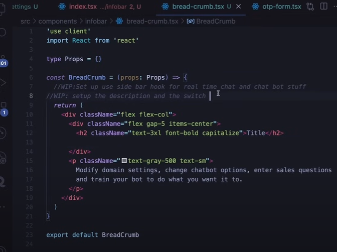

# 2 July

## Custom Clerk Auth components without watermark

1. ~~Create components/forms/form-provider.tsx~~
2. ~~Create AuthContextProvider~~
3. ~~Create useSignupForm hook~~
4. ~~Create authSchema~~
5. ~~onCompleteUserRegistration action~~
6. ~~complete signup provider now.~~
7. ~~complete signup page now.~~
8. ~~create Registration form step~~
9. ~~create typeselection form.~~
10. ~~create user-type-card.~~
11. ~~copy tailwind config~~
12. ~~create button handler.~~
13. ~~Create highlight bar.~~
14. ~~Create DetailForm.~~
15. ~~create forms.tsx in constant.~~
16. ~~install hookform/error-message.~~
17. ~~Create form generator~~
18. ~~create otp form.~~
19. ~~Setup toaster~~
20. ~~create otp input.~~
21. ~~Create account.~~

# 4 July

1. ~~Copy Sign up page data to sign in page.~~
2. ~~Create sign in form provider.~~
3. ~~create use-sign-in hook~~
4. ~~Create login schema in auth.schema~~
5. ~~Create login form.~~

# 11 July

1. Fixed the signup issue, Issue was validation schema has fullname.
2. Code completed till login page.

# 12 July

1. ~~create navbar~~
2. ~~Import this in root page.tsx~~
3. ~~change the font in layout.tsx~~
4. ~~install next themes~~
5. ~~create theme-provider.~~
6. ~~create landing-page.ts~~

7. create 5 blog post on cloudway use cloudways maybe?
8. install axios and html-react-parser
9. create landing action and create onGetblogpost function
10. Create blog/[id]/page.tsx
11. create onGetBlogpost action

12. ~~create dashboard route groups then settings then page.tsx~~
13. ~~create infobar~~
14. ~~create breadcrumb component. Don't create useSidebar hook yet.~~
    
15. Create Billing settings components in settings components.
16. ~~Create onGetSubscription plan action in setting action~~
17. ~~Create section component.~~
18. ~~create layout.tsx inside dashboard route groups~~
19. ~~create onLoginUser action inside auth action.~~
20. ~~create onGetAllAccountDomain action in setting action~~
21. ~~create user-chat-context.tsx in context~~
22. ~~create sidebar component~~
23. ~~create use-sidebar.ts~~
24. ~~create onToggleRealTime in conversation action.~~
25. ~~create onGetConversationMode action in conversation action.~~
26. ~~create maximized-menu and minimized-menu.~~
27. ~~create menu.ts in constants folder.~~
28. create tab menu props as well.
29. create tab menu
30. ~~create domain menu component.~~
31. ~~create use-domain.ts in hooks/sidebar.~~

# 13 July

1. ~~install @uploadcare/blocks~~
2. ~~get public key next_upload_public~~
3. ~~create adddomain schema in settings.schema~~
4. ~~create onIntegrateDomain in settings action~~
5. ~~create drawer component~~
6. ~~create uploadbutton~~
7. ~~create menu-item for sidebar~~
8. ~~create minimized menu.~~
9. ~~render sidebar on dashboard route group layout and render the children as well.~~
10. ~~complete the billing settings page now except subscription form~~
11. ~~Fix breadcrumb now.~~

# 14 July

1. ~~create dark-mode component~~
2. ~~create use-setting hook in settings~~
3. ~~create darkmode.tsx, lightmode.tsx and systemmode.tsx in theme-placeholder components.~~
4. ~~create change password~~
5. ~~create useChangePassword hook in settings~~
6. ~~create changepassword schema~~
7. ~~create onUpdatePassword action~~
8. ~~create dynamic route for domain.~~
9. ~~create onGetCurrentDomainInfo action in settings.~~
10. ~~create settingsform.~~
11. ~~create useSetting hook~~
12. ~~create DomainSettingSchema~~
13. ~~create onUpdateDomain action.~~
14. ~~create onChatbotimageupdate action.~~
15. ~~create onupdatewelcomemessage action.~~

# 15 July

1. ~~create ondeleteuserdomain action.~~
2. ~~create domain-update component.~~
3. ~~create code-snippet component.~~
4. ~~edit chatbot icon component~~
5. ~~create greeting message component.~~
6. ~~create bottrainingform now.~~
7. ~~create tabs component.~~
8. ~~create HELP_DESK_TABS_MENU.~~
9. ~~create helpdesk component.~~
10. ~~create useHelpdesk hook.~~
11. ~~create helpdeskquestionschema.~~
12. ~~create onCreateHelpdeskquestion action.~~
13. ~~create onGetAllHelpDeskQuestions action.~~
14. ~~create accordian component.~~
15. ~~create filterquestions components~~
16. ~~create useFilterQuestion hook.~~
17. ~~create filterquestionschema as well.~~
18. ~~create onCreateFilterQuestion action.~~
19. ~~create onGetAllFilterQuestions action.~~

# 16 July

1. create conversation page.
2. ~~create conversation menu component~~
3. ~~create use-conversation hook inside the conversation.~~
4. ~~create conversationsearchschema.~~
5. ~~create onGetDomainChatRooms action.~~
6. ~~create onGetChatMessages action.~~
7. ~~create conversationsearch component.~~
8. ~~create chatcard component.~~
9. ~~create useChatTime hook.~~
10. ~~create onViewUnreadMessages action.~~
11. ~~create messenger component.~~
12. ~~create useChatWindow hook.(setup pusher later)~~
13. ~~create chatbotmessageschema.~~
14. ~~bun add pusher, bun add pusher-js.~~
15. ~~create pusher client.~~
16. ~~create onOwnerSendMessage action.~~
17. create onRealtimechat action.(comment it out)
18. ~~create chatbot component with bubble.tsx.~~
19. ~~create uuidfromtring util fn.~~
20. create chatbot page(app/chatbot dont put it inside the dashboard route group).
21. create aichatbot component.
22. create useChatbot hook.
23. create postToParent function in libs
24. create onGetCurrentChatbot.
25. continue @5:50

# 17 July

1. create onAiChatBotAssitant action.
2. create extractemailfromstring util fn.
3. create onStoreConversation action.
4. create onRealtimechat action(comment this on above server action).
5. bun add nodemailer
6. continue @6:00

# 20 July

1. create mailer server action.
2. setup gmail app password.
3. bun add openai
4. create extractUrlfromstring function in utils
5. complete the usechatbot hook.
6. create botwindow component.
7. create realtimemode component.
8. create useRealtime hook.
9. continue working on chatbot component.
10. create responding component.
11. continue from 6:35

# 22 July

1. Test the chatbot now.
2. create portal layout.
3. create portalbanner component.
4. create dynamic appointment page `app/portal/[domainid]/appointment/[customerid]`
5. create customer signup page on above page.
6. create onDomainCustomerResponses server action.
7. create onGetAllDomainBooking action.
8. create portal form component.
9. create usePortal hook
10. create onBookNewAppointment server action.
11. create portalsteps components.
12. create questionform component.
13. continue from 7:05

# 27 July

1. create bookingappointment date component.
2. create APPOINTMENT_TIME_SLOTS in constants.
3. create save answers server action.
4. create appointment page.
5. create onGetAllBookingsForCurrentUser server action.
6. create allappointments component.
7. create appointment table header in constants.
8. create data table components.
9. create integration route.
10. create onGetPaymentConnected server action.
11. create IntegrationList component.
12. create INTEGRATION_LIST_ITEMS in constants.
13. create IntegrationTrigger component.
14. create modal component.
15. create IntegrationModalBody component.
16. create stripe-connect.tsx
17. create useStripe hook.
18. continue @ 7:42

# 28 July

1. create app/api/stripe/connect/route.ts.
2. bun add stripe
3. add public and secret stripe key in app.
4. create GET route in route.ts
5. create producttable component.
6. create sidesheet component.
7. create createproduct form component.
8. create useProducts hook
9. create addproductprops and addproductschema.
10. create onCreateNewDomainProduct server action.
11. create datatable for All product tab content
12. create page for customerid in portal/domainid/payment folder.
13. create onGetDomainProductsAndConnectedAccountId server action.
14. create product-checkout for portal-steps component.
15. bun add @stripe/stripe-js @stripe/react-stripe-js
16. create useStripeCustomer hook
17. create onCreateCustomerPaymentIntentSecret server action.
18. create customerpaymentform
19. create useCompleteCustomerPayment hook.
20. Email marketing is currently missing.
21. so create subscription form for billing settings components.
22. create useSubscription hook.
23. create onUpdateSubscription action.
24. create subscription card component.
25. create stripe-elements component.
26. create useStripeElements hook
27. create onGetStripeClientSecret action.
28. create setPlanAmount function
29. create paymentform
30. creeate useCompletePayment hook.
31. create dashboard page.
32. create getUserClients server action.
33. create getUserBalance server action.
34. create getUserAppointments server action.
35. create getUserPlanInfo server action.
36. create getUserTransaction server action.
37. create getUserTotalProductPrice server action.
38. create dashboard card
39. create PlanUsage component.
40. create progressbar component.
41. test the portal page now and see trasaction etc.
42. create app on pusher and copy the api keys.
43. uncomment the onRealtimechat from bot action.
44. uncomment pusherServer and client
45. now you can import the useRealtime hook inside the RealtimeMode component.
46. uncomment from useChatWindow hook as well.
47. PROJECT IS COMPLETED EXCEPT EMAIL MARKETING SECTION.

